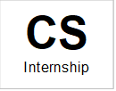
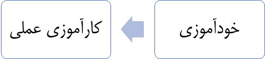
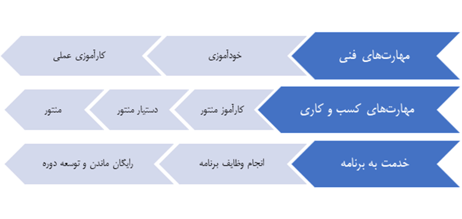

<html><head><meta http-equiv="Content-Type" content="text/html; charset=utf-8"><meta name="Generator" content="Microsoft Word 15 (filtered)"></head><body lang="EN-US" link="#0563C1" vlink="#954F72" style="word-wrap: break-word">

مستند آشنایی با برنامه CS Internship

&nbsp;

&nbsp;

&nbsp;

&nbsp;

&nbsp;

&nbsp;

<table class="MsoTableGrid" dir="rtl" border="1" cellspacing="0" cellpadding="0" style="border-collapse: collapse; border: none"><tr><td width="102" style="width: 76.6pt;
                                border: solid windowtext 1pt;
                                background: #f2f2f2;
                                padding: 0cm 5.4pt 0cm 5.4pt;"> 
تاریخ این نسخه
</td><td width="106" style="width: 79.2pt;
                                border: solid windowtext 1pt;
                                border-right: none;
                                padding: 0cm 5.4pt 0cm 5.4pt;">
1400/07/13
</td><td width="104" style="width: 77.95pt;
                                border: solid windowtext 1pt;
                                border-right: none;
                                background: #f2f2f2;
                                padding: 0cm 5.4pt 0cm 5.4pt;">
شماره این نسخه
</td><td width="104" style="width: 77.9pt;
                                border: solid windowtext 1pt;
                                border-right: none;
                                padding: 0cm 5.4pt 0cm 5.4pt;">
0.240
</td><td width="104" style="width: 77.9pt;
                                border: solid windowtext 1pt;
                                border-right: none;
                                background: #f2f2f2;
                                padding: 0cm 5.4pt 0cm 5.4pt;">
&nbsp;
</td><td width="104" style="width: 77.95pt;
                                border: solid windowtext 1pt;
                                border-right: none;
                                padding: 0cm 5.4pt 0cm 5.4pt;">
&nbsp;
</td></tr><tr><td width="102" style="width: 76.6pt;
                                border: solid windowtext 1pt;
                                border-top: none;
                                background: #f2f2f2;
                                padding: 0cm 5.4pt 0cm 5.4pt;">
عنوان مستند
</td><td width="521" colspan="5" style="width: 390.9pt;
                                border-top: none;
                                border-left: solid windowtext 1pt;
                                border-bottom: solid windowtext 1pt;
                                border-right: none;
                                padding: 0cm 5.4pt 0cm 5.4pt;">
مستند آشنایی با برنامه CS Internship
</td></tr><tr><td width="102" style="width: 76.6pt;
                                border: solid windowtext 1pt;
                                border-top: none;
                                background: #f2f2f2;
                                padding: 0cm 5.4pt 0cm 5.4pt;">
نام فایل
</td><td width="521" colspan="5" style="width: 390.9pt;
                                border-top: none;
                                border-left: solid windowtext 1pt;
                                border-bottom: solid windowtext 1pt;
                                border-right: none;
                                padding: 0cm 5.4pt 0cm 5.4pt;">
CSI - White Paper  - Introduction to CS Internship - Farsi.docx
</td></tr><tr style="height: 52.6pt"><td width="102" style="width: 76.6pt;
                                border: solid windowtext 1pt;
                                border-top: none;
                                background: #f2f2f2;
                                padding: 0cm 5.4pt 0cm 5.4pt;
                                height: 52.6pt;">
توضیحات
</td><td width="521" colspan="5" style="width: 390.9pt;
                                border-top: none;
                                border-left: solid windowtext 1pt;
                                border-bottom: solid windowtext 1pt;
                                border-right: none;
                                padding: 0cm 5.4pt 0cm 5.4pt;
                                height: 52.6pt;">
هدف این مستند ایجاد آشنایی اولیه با برنامه CS Internship و مکانیسم‌های آن برای افرادی است که قرار است به عنوان اینترن وارد دوره شوند.
</td></tr></table>

&nbsp;

&nbsp;
 
&nbsp;
<h1 dir="RTL" style="text-align: justify">برنامه در یک نگاه</h1>
برنامه CS Internship برنامه‌ای است‌ آموزشی برای پرورش نیروهای مهندسی نرم‌افزار برای ورود به بازار کار از طریق کسب مهارت‌های فنی و کسب و کاری لازم برای خلق ارزش در تیم‌های تولید نرم‌افزار ایرانی و بین‌المللی، چه در سازمان‌های بزرگ و چه استارتاپ‌های کوچک. این برنامه در طول پنج سال گذشته توسط تعدادی از متخصصین تولید نرم‌افزار کشور با بیش از ده‌ها سال تجربه کار در بزرگ‌ترین سازمان‌های ایران و جهان طراحی و با کمک بیش از 100 نفر از جوانان با استعداد و متعهد مملکت پیاده‌سازی، عملیاتی و چکش‌کاری شده است. فارغ‌التحصیلان این برنامه غالباً توانسته‌اند با حقوق‌های بالا وارد تیم‌های حرفه‌ای تولید نرم‌افزار شوند و در پروژه‌های داخلی و خارجی به خلق ارزش بپردازند.

برنامه CS Internship یک شخصیت حقوقی ندارد، یعنی یک شرکت، کسب و کار یا آموزشگاه نیست. در حقیقت، این برنامه چیزی نیست جز مجموعه‌ای از جوانان و متخصصین حوزه نرم‌افزار که برای افزایش سطح مهارت‌های فنی و کسب و کاری خود، تصمیم گرفته‌اند با همدیگر به صورت کاملاً داوطلبانه و غیر رسمی ولی با جدیت و دیسیپلین بسیار همکاری داشته باشند. چیزی شبیه یک گروه دوست که تصمیم می‌گیرند برای بالا بردن توان درآمدزایی و افزایش فرصت‌های اقتصادی خود به همدیگر کمک کنند، بدون اینکه چشم‌داشتی نسبت به همدیگر داشته باشند.

بنابرین، در ازای استفاده از موقعیت‌های آموزشی و فرصت‌های کسب و کاری فراهم آمده در برنامه، در CS Internship نه کسی به کسی پول می‌دهد و نه کسی از کسی پول دریافت می‌کند. به غیر از یک سری سازمان‌هایی که امکان دارد در آینده در طول دوره «کارآموزی عملی» این برنامه در آن سازمان‌ها در صورت صلاحدید خود اقدام به پرداخت کمک هزینه‌ای به شرکت‌کنندگان این برنامه کنند، کل فرآیندهای دوره به صورت داوطلبانه، بدون پرداخت هزینه و بدون دریافت دستمزد انجام می‌شود.
<h2 dir="RTL"><a name="_Toc91935138">پیش‌نیازها برای ورود</a></h2>
این برنامه کاملاً به صورت ریموت برگزار می‌شود و اصلاً از ابتدا طوری طراحی شده است تا شرکت‌کنندگان را برای کار در تیم‌های ریموت ایرانی و خارجی آماده کند. برای ورود به آن، افراد به یک کامپیوتر مناسب برای برنامه‌نویسی و یک خط اینترنت که از پهنای باند لازم برای شرکت در جلسات تصویری برخوردار است نیاز دارند.

پیشینه تحصیلی و کاری افرادی که وارد این برنامه می‌شوند برای ما اهمیت ندارد. آنچه مهم است، انگیزه و تعهد فرد برای خلق آینده‌ای جدید برای خود از طریق فعالیت در صنعت مهندسی نرم‌افزار است. تاکنون گستره متنوعی از افراد، مانند دانشجویان یا فارغ‌التحصیلان رشته‌های نرم‌افزار، علوم کامپیوتر یا رشته‌های مربوطه، دانش‌آموزان دبیرستانی، خانم‌های خانه‌دار و افرادی که قصد تغییر شغل داشته‌اند از سراسر ایران در این برنامه شرکت ‌کرده‌اند.

با این حال، برای موفقیت در این برنامه، <b>تجربه قبلی با برنامه‌نویسی</b> و <b>آشنایی با زبان انگلیسی</b> در حد خواندن متون کتاب‌های برنامه‌نویسی و استفاده از ویدیوهای آموزشی مربوطه لازم خواهد بود. عدم برخورداری از این مهارت‌ها جلوی ورود فرد به برنامه را نمی‌گیرد، ولی حجم کار وی برای فارغ‌التحصیل شدن از برنامه را به شدت بالا می‌برد.
<h2 dir="RTL"><a name="_Toc91935139">فرایند دوره</a></h2>
به افرادی که برای یادگیری در برنامه CS Internship شرکت می‌کنند، اصطلاحا «اینترن» گفته می‌شود. آموزش‌های برنامه طوری طراحی شده‌اند تا دو مجموعه متفاوت از مهارت‌های مهم برای موفقیت در صنعت مهندسی نرم‌افزار را به اینترن‌ها منتقل کنند. یکی از این مجموعه مهارت‌ها، طبیعتاً <b>«مهارت‌های فنی»</b> است، یعنی مهارت‌های تخصصی که برای کار در صنعت نرم‌افزار لازم است. ولی مجموعه دیگر، که از دید ما برای موفقیت یک مهندس نرم‌افزار حتی از مهارت‌های فنی هم مهم‌تر هستند، <b>«مهارت‌های کسب و کاری»</b> نامیده می‌شوند. به طور خلاصه، این‌ها شامل مهارت‌هایی هستند که به یک مهندس نرم‌افزار اجازه می‌دهند به عنوان عضوی از یک تیم تولید نرم‌افزار در راستای اهداف یک کسب و کار خاص و تحت مدیریت لایه مدیریت سازمانی آن کسب و کار، با همراهی و همکاری نزدیک با دیگر اعضای تیم، اقدام به کار و خلق ارزش واقعی برای آن سازمان، هم‌تیمی‌ها و خود نماید.

برنامه CS Internship از چند دوره آموزشی مختلف تشکیل شده است که هر کدام روی یک شاخه فنی و تخصصی خاص متمرکز است. در حال حاضر، دوره‌های برنامه عبارتند از «توسعه وب»، «برنامه‌نویسی C#» و «یادگیری ماشین». هر فرد فقط می‌تواند در آن واحد در یکی از این دوره‌ها شرکت کند. شرکت‌کنندگان معمولاً بین 25 تا 30 ساعت در هفته روی دوره زمان صرف می‌کنند و بستگی به سرعت یادگیری و حرکت خود، تکمیل کل برنامه معمولاً بین یک تا دو سال زمان می‌برد. سرعت حرکت هر فرد در برنامه به عهده خود وی است.

قول برنامه CS Internship به اینترن‌های این برنامه این است که در پایان هر دوره خاص، فرد اینترن بتواند به عنوان یک نیروی متخصص Junior (یعنی تازه وارد و کم تجربه) وارد تیم‌های حرفه‌ای تولید نرم‌افزار کشور شود. به عبارت دیگر، مهارت‌های فنی و کسب و کاری که فرد در طول دوره با ممارست و سخت‌کوشی به دست خواهد آورد، دقیقاً آن دسته از مهارت‌ها هستند که تمامی تیم‌های حرفه‌ای تولید نرم‌افزار برای نیروهای تازه وارد خود به دنبال آن هستند ولی به ندرت مجموع آن‌ها را با هم در افراد تازه وارد پیدا می‌کنند. موفقیت CS Internship در امر آموزش و انتقال این مهارت‌ها منجر به این شده است که تقاضا و رقابت بالایی برای استخدام فارغ‌التحصیلان این برنامه وجود داشته باشد.

حرکت در هر دوره در <b>سه مسیر موازی</b> و <b>دو مرحله مختلف</b> انجام می‌شود.
<h1 dir="RTL"><a name="_Toc91935140">مراحل دوگانه برنامه</a></h1>
دو مرحله هر دوره عبارتند از مرحله «خودآموزی» و مرحله «کارآموزی عملی».

<h2 dir="RTL"><a name="_Toc91935141">مرحله خودآموزی</a></h2>
در مرحله خودآموزی که معمولاً بین 6 ماه تا یک سال طول می‌کشد، فرد اینترن در عمل <b>یاد می‌گیرد که چگونه یاد بگیرد</b>. حقیقت این است که در دنیای امروز، از مهندسین نرم‌افزار حرفه‌ای انتظار می‌رود که به جای شرکت در دوره‌های آموزشی، خود بتوانند با سرعت بالا، همه زبان‌ها، ابزارها، برنامه‌ها و مباحث جدید فناوری که برای پروژه‌های جدید آنها لازم است را یاد بگیرند. طبیعتاً، هدف اصلی برنامه CS Internship پرورش نیروهایی است که مهارت این را دارند که خود هر آنچه را که لازم است در مورد مسائل فنی بدانند را با استفاده از منابع موجود به خود آموزش دهند.

به عبارت دیگر، در دوره‌های آموزشی برنامه CS Internship، <b>هیچ کس چیزی به کسی تدریس نمی‌کند</b>. کل دوره‌ها به صورت برنامه‌های خودآموزی اجرا می‌شوند. ولی در طول هر دوره، تعداد زیادی افراد به عنوان راهنما در کنار اینترن‌ها حرکت می‌کنند. این راهنماها با عنوان «منتور» شناخته می‌شوند. منتورها کسانی هستند که پیش از این، یا یکی از دوره‌های برنامه CS Internship را گذرانده‌اند یا همین حالا به عنوان اینترن مشغول گذراندن یکی از دوره‌ها هستند. منتورها به صورت داوطلبانه به اینترن‌ها در طی کردن مسیر برنامه کمک می‌کنند، همانطور که منتورهای دیگر به آن‌ها کمک کردند. منتور شدن یکی از الزامات برنامه CS Internship برای همه اینترن‌ها است. به عبارت دیگر، <b>هر اینترنی باید یک روز منتور شود</b>، وگرنه از برنامه فارغ‌التحصیل نخواهد شد.

مرحله خودآموزی هر دوره از تعداد مشخصی «قدم» یا «Step» تشکیل شده است. هر کدام از این قدم‌ها تعریف دقیقی دارند که شامل یک سری فعالیت‌ها و نتایج مطلوبی که باید نتیجه آن فعالیت‌ها باشند، می‌باشد. این قدم‌ها باید به ترتیب توسط همه اینترن‌ها تکمیل شوند. یک اینترن نخواهد توانست به قدم‌های بعدی دوره برود، مگر اینکه همه قدم‌های قبلی را با موفقیت تکمیل کرده باشد. در پایان موفقیت آمیز آخرین Step هر دوره، اینترن آماده است تا وارد مرحله دوم دوره، یعنی مرحله کارآموزی عملی شود.
<h2 dir="RTL"><a name="_Toc91935142">مرحله کارآموزی عملی</a></h2>
فلسفه مرحله کارآموزی عملی این است که فرآیند خودآموزی تنها می‌تواند بخشی از دانش و مهارت‌های فنی لازم را برای ورود موفقیت‌آمیز به بازار کار به اینترن‌ها منتقل کند. کار در کنار افراد با تجربه، تعامل با یک تیم حرفه‌ای و یاد گرفتن از آن‌ها نقش مهمی در کسب بقیه این دانش و مهارت‌ها ایفا می‌کنند. مرحله کارآموزی عملی این فرصت را در اختیار اینترن قرار می‌دهد که به عنوان کارآموز برای مدت شش ماه در یک تیم حرفه‌ای تولید نرم‌افزار کار کند تا فرآیند یادگیری خود را ادامه دهد.

برنامه CS Internship با تعدادی از شرکت‌های تولید نرم‌افزار که علاقه دارند فرصتی برای یادگیری عملی در اختیار اینترن‌های برنامه قرار دهند همکاری نزدیک دارد. این فرصت‌های کارآموزی غالباً بدون حقوق و مزایا در اختیار کارآموز قرار می‌گیرند، گرچه برخی از شرکت‌ها به صلاحدید خود شاید اقدام به پرداخت کمک‌هزینه‌هایی به کارآموزان جذب شده نمایند. شرکت‌هایی که علاقه به جذب کارآموز از برنامه را دارند، «شرکت‌های پشتیبان برنامه» نامیده می‌شوند.  این شرکت‌ها تعهد می‌کنند که از یک سری استانداردهای فنی و رفتاری که ادامه فرآیند یادگیری اینترن را در طول دوره کارآموزی وی تضمین می‌کند، پیروی کنند. در صورتی که هر یک از این شرکت‌ها در عمل این کار را نکند، آن شرکت از برنامه CS Internship کنار گذاشته خواهد شد و قادر به جذب اینترن‌های برنامه نخواهد بود.

معمولاً، در طی دو ماه اول دوره کارآموزی عملی، اینترن‌ها هیچ خروجی خاصی برای شرکت‌های پشتیبان ندارند و تنها روی یادگیری فرآیندهای تولید، ابزارها و فناوری‌های مورد استفاده در آن شرکت‌ها متمرکز خواهند بود. معمولاً بعد از دو ماه، اینترن‌ها به جایی می‌رسند که برخی از کارهایشان برای شرکت خروجی داشته باشد. در طی بازه دو ماه آخر مرحله کارآموزی عملی، از اینترن‌ها انتظار می‌رود که تاثیر مناسبی روی پروژه‌های در دست انجام در آن شرکت‌ها بگذارند.

اینترن‌هایی که دوره کارآموزی عملی 6 ماهه خود را با موفقیت به پایان می‌رسانند، در عمل از برنامه CS Internship فارغ‌التحصیل می‌شوند. درصد قابل توجهی از آن‌ها معمولاً در همان شرکتی که کارآموزی عملی خود را انجام داده‌اند استخدام می‌شوند. بقیه از طرف منتورهای باتجربه برنامه CS Internship برای کار به شرکت‌های دیگری که معمولاً رغبت زیادی به کار با فارغ‌التحصیلان برنامه دارند، معرفی می‌شوند.

برنامه CS Internship هیچ مبلغی از شرکت‌های پشتیبان برنامه در ازای آموزش یا معرفی اینترن‌های برنامه دریافت نمی‌کند.

هر اینترنی که مرحله خودآموزی را با موفقیت پشت سر می‌گذارد به صورت خودکار وارد مرحله کارآموزی عملی نمی‌شود. شرکت‌هایی که برنامه کارآموزی عملی را برگزار می‌کنند، آزاد هستند که تنها اینترن‌هایی که نظر آن‌ها را جلب می‌کنند انتخاب کنند، کما اینکه اینترن‌ها هم این فرصت را دارند که از بین شرکت‌های مختلف تیم مورد علاقه خویش را انتخاب کنند. فعالیت‌های شما در شبکه‌های اجتماعی و پروفایل شما معمولا تاثیر زیادی به ایجاد علاقمندی در این شرکت‌ها دارد. شروع مرحله کارآموزی عملی به توافق طرفین بستگی دارد و بستگی به سطح مهارت‌های فنی و کسب و کاری اینترن دارد.
<h1 dir="RTL"><a name="_Toc91935143">مسیرهای موازی سه‌گانه برنامه</a></h1>
سه مسیر موازی برنامه CS Internship عبارتند از:

·&nbsp;&nbsp;&nbsp;&nbsp;&nbsp;&nbsp; «مسیر یادگیری مهارت‌های فنی»

·&nbsp;&nbsp;&nbsp;&nbsp;&nbsp;&nbsp; «مسیر یادگیری مهارت‌های کسب و کاری»

·&nbsp;&nbsp;&nbsp;&nbsp;&nbsp;&nbsp; «مسیر خدمت به جامعه CS Internship»

<h2 dir="RTL"><a name="_Toc91935144">مسیر یادگیری مهارت‌های فنی</a></h2>
مسیر فنی برنامه در قسمت پیش تشریح شد و شامل انتخاب یک دوره فنی، انجام موفقیت آمیز همه قدم‌های مرحله خودآموزی آن، ورود به مرحله کارآموزی عملی و تکمیل موفقیت آمیز آن مرحله است.
<h2 dir="RTL"><a name="_Toc91935145">مسیر یادگیری مهارت‌های کسب و کاری</a></h2>
تجربه بنیان‌گذاران برنامه CS Internship نشان می‌دهد که پروژه‌های نرم‌افزاری کشور به ندرت به خاطر مشکلات فنی با شکست روبرو می‌شوند. علت اصلی بخش اعظم پروژه‌های شکست خورده در ایران، عدم برخورداری اعضای تیم از یک سری مهارت‌های کسب و کاری، به خصوص مهارت‌های حوزه ارتباطی و تعاملات انسانی و تیمی است.

این مهارت‌ها شامل مهارت‌هایی هستند مانند <b>صحبت کردن</b>، <b>شنیدن</b>، <b>سوال کردن</b>، <b>جواب دادن</b>، <b>قول دادن</b>،<b> </b><b>به اشتراک گذاشتن اطلاعات</b>،<b> </b><b>درخواست کمک کردن</b>، <b>کمک کردن به دیگران</b>، <b>حل مسئله</b>، <b>حل اختلاف</b>، <b>کار تیمی</b> و <b>رهبری</b>. این مهارت‌ها به فرد کمک می‌کنند تا در یک تیم نرم‌افزاری به طور موثر با هم‌تیمی‌های خود تعامل داشته و کار تیمی انجام دهد. مهارت‌های کسب و کاری، نقشی کلیدی در موفقیت یا شکست تیم‌های نرم‌افزاری ایفا می‌کنند. به همین دلیل، در کنار آموزش مهارت‌های فنی، تمرکز اصلی ما در برنامه CS Internship آموزش مهارت‌های کسب و کاری است.&nbsp;

مکانیزم اصلی که از آن برای انتقال مهارت‌های کسب و کاری در برنامه CS Internship استفاده می‌شود، فرآیند منتور شدن است. به همین دلیل «منتور شدن» یکی از قدم‌های مهم برای اینترن‌ها در برنامه است که حتما وارد آن خواهند شد.

در CS Internship، سه نوع سطح منتور وجود دارند: «کارآموز منتورها»، «دستیار منتورها» و «منتورها».
<h3 dir="RTL"><a name="_Toc91935146">کارآموزمنتورها</a></h3>
از هر اینترن جدید که وارد برنامه CS Internship می‌شود انتظار می‌رود در طی مدت زمانی بین 4 تا 6 ماه صلاحیت لازم برای ورود به سطح کارآموزمنتوری را به دست آورد و به عنوان یک کارآموزمنتور شروع به انجام وظیفه در برنامه کند. مسئولیت اصلی کارآموزمنتورها همراهی اینترن‌های جدید در فرآیند ورود به برنامه و آغاز قدم‌های مرحله خودآموزی آن‌ها می‌باشد. در برنامه به طور خاص، به نقشی که مسئولیت همراهی اینترن را در چارچوب مشخص‌شده در آن نقش بر عهده دارد، کوردینیتور (Coordinator) گفته می‌شود. کوردینیتورها به صورت مستقیم از نزدیک با اینترن‌ها کار می‌کنند تا آنها را در طی مسیر خود همراهی و راهنمایی کنند و مجاز هستند هر گونه سوالی را که اینترن‌ها در مورد مکانیزم‌های اجرایی و قوانین دور دارند پاسخ دهند و بقیه سوالات اینترن‌ها را به دستیارمنتورها یا منتورهای دیگر ارجاع دهند.

فرآیند آموزش اینترن‌ها برای فعالیت به عنوان یک کارآموز منتور بعد از قدم اول مرحله خودآموزی آغاز می‌شود و برای نزدیک به 4 ماه ادامه پیدا می‌کند. این فرآیند شکل مشاهده محتواهای ویدیویی، خواندن مستندات، شرکت در جلسات گفتگو و آموزشی و کسب مجوز کارآموزمنتوری از طریق مصاحبه با یک سری منتورهای ارشد برنامه، را به خود می‌گیرد. تمرکز اصلی این آموزش‌ها روی بحث اصول برقراری ارتباطات با انسان‌های دیگر است.
<h3 dir="RTL"><a name="_Toc91935147">دستیارمنتورها</a></h3>
 اینترن‌هایی که درجه کارآموزمنتوری را به دست آورده‌اند، وارد فرآیند آموزش دستیارمنتوری خواهند شد. این فرآیند آموزشی تا پایان مرحله خودآموزی اینترن ادامه دارد. اینترن‌هایی که با موفقیت به سطح دستیارمنتوری می‌رسند، در مقابل اینترن‌های دوره نقش منتورفنی را ایفا می‌کنند، به این معنی که حق این را دارند که ضمن مدیریت عملکرد چند کارآموز منتور، به سوالات فنی اینترن‌ها پاسخ دهند.

برای اتمام موفقیت‌آمیز مرحله خودآموزی برنامه و ورود به مرحله کارآموزی عملی، اینترن‌ها ملزم هستند که آموزش‌های فرآیند دستیارمنتوری را با موفقیت پشت سر گذاشته باشند و مجوز دستیارمنتور شدن را از یک سری منتورهای ارشد برنامه دریافت کرده باشند.
<h3 dir="RTL"><a name="_Toc91935148">منتورها</a></h3>
اینترن‌هایی که وارد مرحله کارآموزی عملی می‌شوند، به موازات وارد فرآیند آموزش منتوری هم خواهند شد. این فرآیند تا پایان مرحله کارآموزی عملی زمان می‌برد. برای فارغ‌التحصیل شدن از برنامه و معرفی به شرکت‌های متقاضی برای استخدام، یک اینترن باید آموزش‌های منتوری را با موفقیت به پایان رسانیده باشد و مجوز منتور بودن را از منتورهای ارشد برنامه دریافت کرده باشد. فرآیند آموزش منتورها تمرکز خاصی روی آشنایی با بحث نوروبیولوژی روابط انسانی دارد. منتورها اجازه دارند در مورد مسایل انسانی، تعاملی، تیمی، اختلافات شخصی و مسایل انگیزشی برای خروج از دوره یا ادامه آن با اینترن‌ها تعامل داشته باشند.

در نتیجه، همه منتورهایی که با برنامه CS Internship همکاری می‌کنند کسانی هستند که قبلاً از این برنامه فارغ‌التحصیل شده‌اند. در حالی که کارآموزمنتورها خود مشغول سپری کردن مرحله خودآموزی برنامه هستند و دستیارمنتورها مشغول گذراندن مرحله کارآموزی عملی.
<h2 dir="RTL"><a name="_Toc91935149">مسیر خدمت به جامعه </a>CS Internship</h2>
از اینترن‌هایی که به درجه کارآموزمنتوری می‌رسند، انتظار می‌رود حداقل ۵ ساعت در هفته در انجام کارهایی که برای ادامه و رشد دوره لازم است به بقیه اعضای جامعه CS Internship کمک کنند. کل خدماتی که CS Internship در اختیار اینترن‌ها قرار می‌دهد به صورت داوطلبانه توسط اینترن‌ها، کارآموزمنتورها، دستیارمنتورها، منتورها و سایر فارغ‌التحصیلان این برنامه طراحی، پیاده‌سازی و اجرا شده است. حجم زیادی کار پشت صحنه انجام می‌شود تا یک اینترن بتواند به راحتی و بدون مشکل یا اختلال از این خدمات استفاده کند. در ازای دریافت این خدمات، اینترن‌ها تعهد می‌کنند که در انجام کارهایی که برای ادامه ارائه این خدمات لازم است، به بقیه اعضای جامعه CS Internship کمک کنند.

<b>&nbsp;</b>
<h1 dir="RTL"><a name="_Toc91935150">اینتگریتی، مهم ترین اصل</a></h1>
در برنامه CS Internship مفهومی به نام اینتگریتی (Integrity) زیربنای تمام فعالیت‌های ما است و مهمترین ارزشی است که آن را هر روز و هر لحظه تمرین می‌کنیم.

اینتگریتی، یکی از ارزش‌هایی است که در این برنامه عمیقاً به نهادینه کردن آن می‌پردازیم. ما معتقدیم که بدون پایبند بودن به اصل اینتگریتی هرگز نمی‌توانیم در یک کار تیمی مفید و موثر باشیم.

اینتگریتی در ساده‌ترین حالت در قالب ۳ بند، به صورت زیر تعریف می‌شود:

1.&nbsp;&nbsp;&nbsp; <b>من به هر حرفی که می‌زنم عمل می‌کنم: </b>اگر من حرفی زده‌ام و گفته‌ام که در زمان خاصی کاری را انجام می‌دهم، حتما تا آن زمان آن کار را انجام می‌دهم، چون من این حرف را زده‌ام و حرف من برای من ارزشمند است. تمامی گفته‌های من مانند «من در ساعت ۱۲ بعدالظهر با شما تماس میگیرم»، «من به اطلاع همکار خود می‌رسانم که ...» یا «من کار X را با این کیفیت تا این زمان، انجام خواهم داد» شامل این بند می‌شود. هر آنچه بر زبان می‌آورم، فارغ از اینکه مربوط به انجام بخشی از یک پروژه برنامه نویسی باشد یا مربوط به هر امر دیگری، کلام من است و برای من مهم است.

2.&nbsp;&nbsp;&nbsp; <b>همان لحظه اطلاع می‌دهم: </b>در صورتی که به این نتیجه برسم که انجام دادن آنچه گفته‌ام امکان پذیر نیست، در همان لحظه‌ای که متوجه شدم، موضوع را به اطلاع افرادی که نیاز هست می‌رسانم.

ممکن است در تخمین کارها اشتباه کرده باشم یا با یک موقعیت غیرقابل پیش‌بینی مواجه شوم. در صورت بروز چنین اتفاقاتی احتمالاً نمی‌توانم به آنچه گفته‌ام، پایبند بمانم و عمل کنم. در چنین شرایطی باید به محض اینکه متوجه شدم به هر دلیلی به حرف خود عمل نخواهم کرد، افرادی که نیاز هست در جریان قرار بگیرند را <b>همان لحظه</b> مطلع کنم.

&nbsp;

3.&nbsp;&nbsp;&nbsp; <b>جبران بهم ریختگی پیش آمده: </b>وقتی من به حرف خود عمل نکرده‌ام، عملا باعث بهم ریختگی در برنامه دیگران و در نهایت بهم ریختگی سیستم شده‌ام. در این صورت وظیفه و تعهد خود می‌دانم که هر کاری در توانم باشد را برای رفع این بهم ریختگی که برای بقیه به وجود آورده‌ام انجام دهم. 

هم‌تیمی‌های من، بر پایه‌ی گفته‌های من برنامه‌ریزی می‌کنند. بنابراین، اگر من نتوانم به تعهدم عمل کنم، نه تنها به دیگران اطلاع می‌دهم، بلکه تمامی مسئولیت این اتفاق را به عهده می‌گیرم. به این معنا که اگر در اثر تغییر در برنامه‌ها، خسارتی به هم‌تیمی‌ام یا به مسیر کار تیم وارد شود، من وظیفه دارم، هر آنچه نیاز باشد را برای جبران کامل این خسارت انجام ‌دهم.

اینتگریتی مهمترین اصل این برنامه است. تمام کارهای ما بر پایه این اصل انجام می‌شود. قبل از اینکه وارد دوره‌ آموزشی مورد نظر خود شوید متعهد خواهید شد که به اینتگریتی پایبند هستید. در طول دوره آموزشی همیشه اینتگریتی برای ما مهم است و با این عینک با هم تعامل خواهیم داشت. در صورت نقض اصل اینتگریتی در واقع شما تعهد خود را زیر پا گذاشته‌اید و ممکن است از برنامه کنار گذاشته ‌شوید.
<h1 dir="RTL"><a name="_Toc91935151">فرایند اجرایی </a>اینترن</h1>
همانطور که گفته شد، مسیر دوره از دو مرحله تشکیل شده: «خودآموزی» و «کارآموزی عملی»

هر اینترن که وارد دوره‌های ‌آموزشی برنامه CS Internship می‌شود مسیر یادگیری خود را با «خودآموزی» شروع می‌کند. در ادامه هر یک از این بخش‌ها را به طور کامل توضیح می‌دهیم.

اولین بخش از دوره آموزشی «خودآموزی» است. خودآموزی از چندین قدم (step) تشکیل می‌شود که باید به ترتیب آنها را طی کنید.
<h2 dir="RTL">مفهوم قدم (Step)</h2>
 هر دوره شامل حدودا ۱۰ قدم است، ولی دوره‌های آموزشی مختلف ممکن است تعداد قدم‌های کمی بیشتر یا کمتر داشته باشند.

هر قدم شامل اقلام زیر است:

·&nbsp;&nbsp;&nbsp;&nbsp;&nbsp;&nbsp; <b>اقلام مطالعاتی (</b><b>Study Item</b><b>): </b>منابع و مطالبی که باید مطالعه شوند. این منابع مطالعاتی اصطلاحاً یک قلم مطالعاتی (study item) نامیده می‌شوند. یک قلم مطالعاتی می‌تواند بخشی از یک کتاب، یک ویدیو آموزشی و یا یک مقاله باشد.

·&nbsp;&nbsp;&nbsp;&nbsp;&nbsp;&nbsp; <b>کارها (</b><b>Tasks</b><b>): </b>کارهایی در هر قدم تعریف شده است که اصطلاحاً به آنها تسک‌ها (task) می‌گوییم. جست‌وجو درباره یک موضوع، مفهوم یا ابزار خاص، انجام یک تمرین برنامه‌نویسی، تمرین تایپ ده انگشتی و فعالیت در سایت استک‌اورفلو مثال‌هایی از تسک‌ها هستند.

·&nbsp;&nbsp;&nbsp;&nbsp;&nbsp;&nbsp; <b>مسیر منتورینگ:</b> در هر قدم، بخشی تحت عنوان آموزش منتورینگ (Mentoring Training) گنجانده شده است. در این بخش کارهایی که شما باید در راستای مسیر منتورینگ انجام دهید شرح داده شده‌ است. این کارها ممکن است شامل مشاهده ویدئوها و یا کارهای دیگری باشد.

&nbsp;
<h2 dir="RTL">نحوه انجام یک قدم</h2>
پس از آشنایی با مفهوم قدم، باید بدانیم یک قدم چگونه انجام می‌شود. در ادامه فرایند اجرای یک قدم را توضیح می‌دهیم.
<h3 dir="RTL">تعیین زمان انجام</h3>
<b> </b>در ابتدای هر قدم، مستند آن قدم توسط منتور به شما تحویل داده می‌شود. پس از گرفتن مستند، شما 24 ساعت فرصت دارید تا محتوای آن را بررسی کنید و زمان اتمام آن را برآورد کنید. سپس <b>قول بدهید</b> که دقیقا تا چه تاریخی آن را به طور کامل انجام می‌دهید و آن را به منتور خود اعلام کنید. بدین ترتیب شما ددلاین خود برای به اتمام رساندن قدم را تعیین می‌کنید. همه روی قول شما حساب می‌کنند و فرایند دوره بر اساس قول شما چیده می‌شود.

برای ما در CS Internship شفاف بودن و بی‌ابهام بودن بسیار مهم است. برای اعلام زمان خود، صرفاً تاریخ دقیق اتمام قدم را اعلام کنید. از تعداد ساعتی که نیاز دارید صحبت نکنید، یا برای اعلام تاریخ از قیودی مانند «حدوداً» و «تقریباً» استفاده نکنید.

براساس آنچه از اینتگریتی تعریف کردیم، زمانی که اعلام می‌کنید یک قول از طرف شماست و مطابق اینتگریتی به آن پایبند خواهید بود. هر زمان که متوجه شدید به آن زمان نخواهید رسید آن را <b>همان لحظه </b>به منتور خود اطلاع می‌دهید. در این صورت خود را مسئول بهم ریختگی که به وجود آورده‌اید می‌دانید و تمام تلاشتان را برای رفع این بهم ریختگی می‌کنید.
<h3 dir="RTL">پیشبرد کارها و اقلام مطالعاتی</h3>
<b> </b>پس از تعیین زمان، مطالعه و یادگیری اقلام مطالعاتی و انجام کارها شروع می‌شود.

شما هر هفته طبق تعهدی که دارید، همان میزان ساعت را باید صرف مطالعه و انجام کارها کنید و در حین کار و مطالعه باید در شبکه‌های اجتماعی پست بگذارید. نمود کار شما و مشاهده پیشرفت شما برای دوره از طریق پست‌هایی که می‌گذارید مشاهده و سنجیده می‌شود. این که چه تعداد پست می‌گذارید و یا پست‌های شما چه کیفیتی دارند یکی از مهمترین روش‌هایی است که کار شما دیده می‌شود و مورد بررسی قرار می‌گیرد.

شما در حین انجام کارها یا مطالعات باید پست‌هایی در شبکه‌ها قرار دهید. به ازای هر کار یا قلم مطالعاتی باید یک یا چند پست به ازای هر شبکه اجتماعی داشته باشید. مشخصات پست برای هر کدام از شبکه‌های اجتماعی در زیر توضیح داده شده‌است:

<b>·&nbsp;&nbsp;&nbsp;&nbsp;&nbsp;&nbsp; </b><b>پست‌های </b><b>LinkedIn</b><b>: </b>این شبکه اجتماعتی یک شبکه کاری و حرفه‌ای است و پست‌های شما در این شبکه باید شامل <b>دستاوردهای</b> شما باشد. مهم است که بتوانید در این شبکه در مورد دستاوردهای خود از کاری که انجام داده‌اید صحبت کنید و آن را با بقیه به اشتراک بگذارید و با بقیه تعامل کنید.

<b>·&nbsp;&nbsp;&nbsp;&nbsp;&nbsp;&nbsp; </b><b>پست‌های </b><b>Twitter</b><b>: </b>توییتر شبکه‌ای است که اغلب افراد در مورد زندگی روزمره و احساسات خود می‌نویسند. شما در این شبکه باید در مورد احساساتی که هنگام انجام کارها دارید توییت کنید. بسیار مهم است که بتوانید احساسات درون خود را مشاهده کنید و آنها را با بقیه به اشتراک بگذارید.

هر کدام از مطالب منتشر شده باید حتما دارای هشتگ‌های زیر باشند:

#cs_internship&nbsp;#[courseName]&nbsp;#[stepNumber]

&nbsp;

همچنین به ازای هر کدام از دوره‌های برنامه CS Internship یک گروه تلگرامی با حضور اعضای آن دوره وجود دارد. اعضای هر دوره در گروه تلگرامی دوره خود، گزارشی از فعالیت‌هایشان با دیگر اعضا در میان می‌گذارند. شما نیز باید مطالب فنی خود را در تلگرام و در معرض نگاه و نقد دیگران قرار دهید. علاوه برآنچه گفته شد، گروه تلگرامی بستر مناسبی است برای سوال پرسیدن، کمک گرفتن، جواب دادن به سوال دیگران و کمک به دیگران.
<h3 dir="RTL">برگزاری توییچ</h3>
یکی از آخرین کارها برای اتمام یک قدم برگزاری یک ارايه ۲۰ دقیقه‌ای است که که پس از کامل کردن کارها و مطالعه همه اقلام اطلاعاتی یک قدم انجام می‌شود. این ارائه به صورت آنلاین و در پلتفرم Teams انجام می‌شود. اصطلاحاً به این ارائه آنلاین توییچ می‌گوییم. شما در ارائه خود ۲۰ دقیقه دارید که مال شماست. از طریق آن باید دستاورد‌ها و آموخته‌هایتان در این قدم را توضیح دهید. پس از ارائه توییچ، با تأیید منتورتان، استپ بعدی را می‌توانید شروع کنید.
<h3 dir="RTL">نکات مهم</h3>
در گذراندن هر قدم نکات زیر مهم هستند:

·&nbsp;&nbsp;&nbsp;&nbsp;&nbsp;&nbsp; همه محتوا‌های فنی که قرار است مطالعه کنید یا ببینید به زبان انگلیسی هستند.

·&nbsp;&nbsp;&nbsp;&nbsp;&nbsp;&nbsp; پست‌های که در شبکه‌های اجتماعی می‌گذارید می‌تواند به زبان فارسی یا انگلیسی باشد.

·&nbsp;&nbsp;&nbsp;&nbsp;&nbsp;&nbsp; حضور فعال در شبکه‌های اجتماعی یکی از کارهای مهمی است که باید انجام دهید، پس مطمئن شوید که با آن هیچ مشکلی ندارید.
<h1 dir="RTL">تعهد شما؟</h1>
اگر به ورود به برنامه CS Internship فکر می‌کنید، باید حتما تصمیم مهمی در زندگی خود گرفته باشید. به سوال‌های زیر باید فکر کرده باشید:

·&nbsp;&nbsp;&nbsp;&nbsp;&nbsp;&nbsp; چه برنامه‌ای برای آینده خودم دارم؟

·&nbsp;&nbsp;&nbsp;&nbsp;&nbsp;&nbsp; آیا تصمیم جدی دارم در حوزه نرم‌افزار کار کنم؟

·&nbsp;&nbsp;&nbsp;&nbsp;&nbsp;&nbsp; اولویت این تصمیم چقدر برای من بالا است؟

·&nbsp;&nbsp;&nbsp;&nbsp;&nbsp;&nbsp; چه چیزهایی را حاضرم برای این تصمیم در زندگیم تغییر دهم؟

·&nbsp;&nbsp;&nbsp;&nbsp;&nbsp;&nbsp; چقدر از زمان و انرژی خود را حاضرم برای رسیدن به این هدف اختصاص دهم؟

ما دوره را با شما شروع نمی‌کنیم مگر اینکه مطمئن شویم تصمیم و تعهد شما جدی و واقعی است. از شما می‌خواهیم که پیش از ورود به برنامه به خوبی به آن فکر کنید، سپس تصمیم بگیرید.

</body></html>
